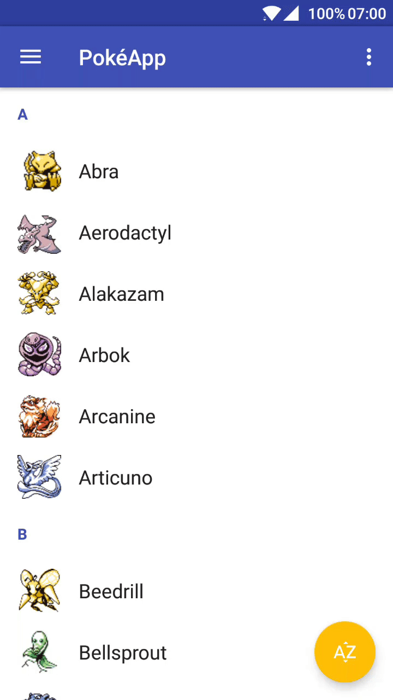

### Modular²Recycler is a `RecyclerView.Adapter` that is modular *squared*.

It also adds extra features:
- OnItem(Long)ClickListener  
- Headers  
- Swipe to dismiss with undo  
- Drag and drop.





## Design Pattern

This library uses the approach of [Modular design](https://en.wikipedia.org/wiki/Modular_design), in which a system is subdivided into modular, reusable components.
A detailed explanation about the architecture of this library can be read [here](https://robbesneyders.github.io/Modular2Recycler).

The ² in Modular²Recycler denotes the modularity of the adapter on two separate levels.

### First Level

Instead of creating one huge adapter to populate a `RecyclerView` with data, one __AdapterModule__ is created for each different viewtype.


### Second Level

Extra funcionality can be added to these __AdapterModules__ by implementing __plugins__ provided by this library.


## Dependencies

This libary can be added to your project by using [JitPack](https://jitpack.io/).

Add Jitpack in your root build.gradle at the end of repositories:

```groovy
allprojects {
    repositories {
        ...
        maven { url 'https://jitpack.io' }
    }
}
```

Add this library as dependency to your project:

```groovy
dependencies {
        compile 'com.github.RobbeSneyders:Modular2Recycler:v1.0.1'
}
```

## How to use

This library does a lot of the necessary work for you. Just follow these steps:  
*Example based on available example app.*


#### 1. For each ViewType  
- Create an item by implementing __ModularItem__
- Create a module by extending __AdapterModule__

*Pokemon & PokemonModule*

```java
public class Pokemon implements ModularItem {
    public String name;
    public Drawable icon;
    
    public boolean isHeader() {
        return false;
    }
}

class PokemonModule extends AdapterModule<PokemonViewHolder, Pokemon> {

    @Override
    public PokemonViewHolder onCreateViewHolder(ViewGroup parent) {
        View itemView = LayoutInflater.from(parent.getContext()).inflate(R.layout.recycler_row, parent, false);
        return new PokemonViewHolder(itemView);
    }

    @Override
    public void onBindViewHolder(PokemonViewHolder viewHolder, Pokemon pokemon) {
        viewHolder.vText.setText(pokemon.name);
        viewHolder.vIcon.setImageDrawable(pokemon.icon);
    }

    public static class PokemonViewHolder extends RecyclerView.ViewHolder {
        public ImageView vIcon;
        public TextView vText;

        public PokemonViewHolder(View view) {
            super(view);
            vText = (TextView) view.findViewById(R.id.textView);
            vIcon = (ImageView) view.findViewById(R.id.imageView);
        }
    }    
}
```

*Header & HeaderModule*

```java
public class Header implements ModularItem {
    String name;

    public Header(String name) {
        this.name = name;
    }
    
    public boolean isHeader() {
        // return true to make ModularAdapter recognize this as a header class.
        return true;
    }
}

class HeaderModule extends AdapterModule<HeaderModule.HeaderViewHolder, Header> {

    @Override
    public HeaderViewHolder onCreateViewHolder(ViewGroup parent) {
        View headerView = LayoutInflater.from(parent.getContext()).inflate(R.layout.recycler_header, parent, false);
        return new HeaderViewHolder(headerView);
    }

    @Override
    public void onBindViewHolder(HeaderViewHolder viewHolder, Header header) {
        viewHolder.vText.setText(header.name);
    }

    static class HeaderViewHolder extends ViewHolder {
        TextView vText;

        HeaderViewHolder(View view) {
            super(view);
            vText = (TextView) view.findViewById(R.id.textView);
        }
    }
}

```

#### 2. Add the desired functionality to your module by implementing the corresponding __plugins__.

```java
public class PokemonModule extends AdapterModule<PokemonViewHolder, Pokemon>
    implements ItemClickPlugin, ItemLongClickPlugin {

    // AdapterModule Methods
    ...

    @Override
    public void onItemClicked(Pokemon pokemon) {
        // Item clicked
    }

    @Override
    public boolean onItemLongClicked(Pokemon pokemon) {
        // Item long clicked
        return true;
    }
```

#### 3. Create an instance of the ModularAdapter in your `Activity`

*There is no need to extend the ModularAdapter class unless you want to add extra functionality.*

```java
List<Pokemon> pokemonList = Pokedex.getAllPokemonAlphabetic();
List<ModularItem> list = addHeaders(pokemonList);

adapter = new ModularAdapterBuilder<>(recyclerView, list)
        .setSwipeLeft(Color.RED, ResourcesCompat.getDrawable(getResources(), R.drawable.ic_delete_white_24dp, null))
        .setSwipeRight(Color.GREEN, ResourcesCompat.getDrawable(getResources(), R.drawable.ic_cloud_upload_white_24dp, null))
        .build();
```

#### 4. Create an instance of the __AdapterModules__ you want to add and bind them to the created instance of __ModularAdapter__

```java
new PokemonModule().bindToAdapter(adapter);
new HeaderModule().bindToAdapter(adapter);
```

## Example App

PokéApp is an example app to demonstrate the use of this library.  
- [Source code](app)  
- [Available on Play Store](https://play.google.com/store/apps/details?id=com.cuttingedge.pokeapp).

[](http://imgur.com/jFQTroq) [](http://imgur.com/5bgXPR2)

## Other apps using this library

[Swipe Shortcuts Widget](https://play.google.com/store/apps/details?id=com.cuttingedge.swipeshortcuts)

## Contributing

Contributions in any way are greatly appreciated.

## License

Code released under the [Apache license](LICENSE).


