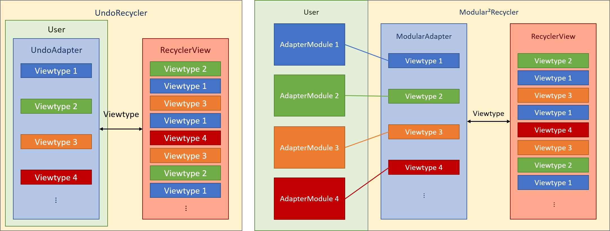
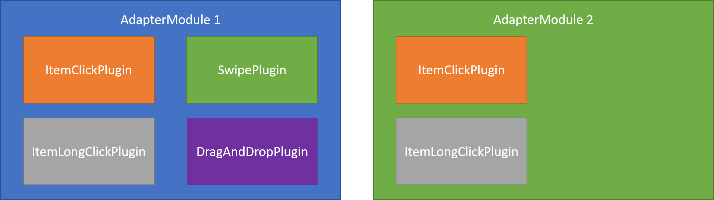
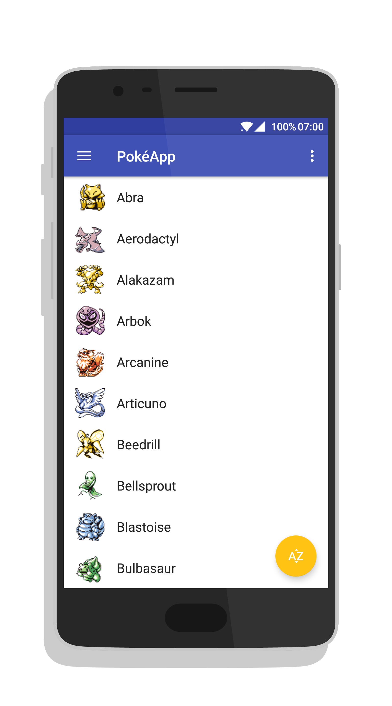
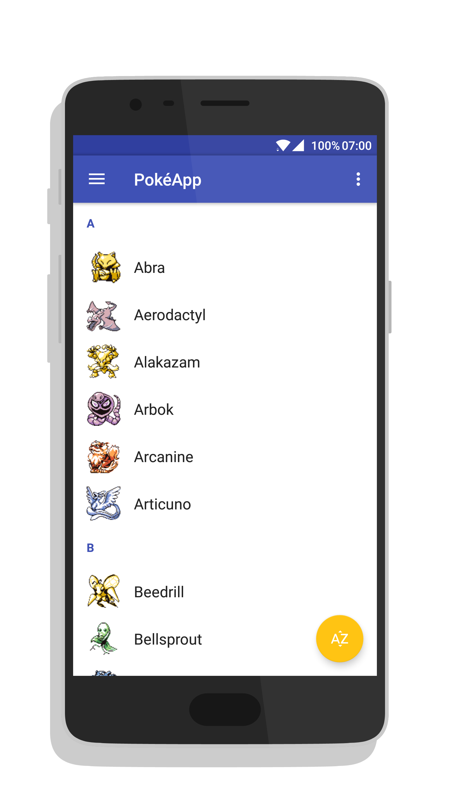
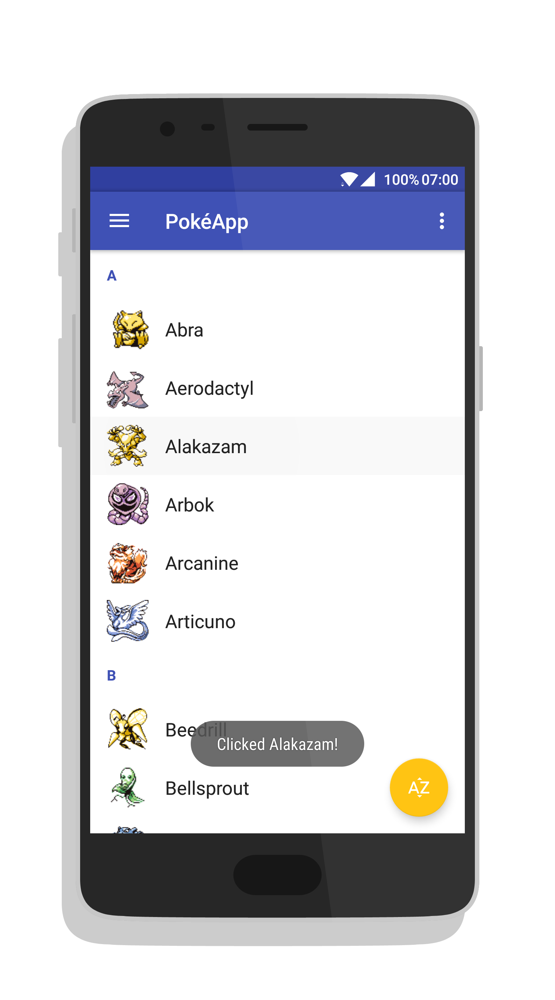
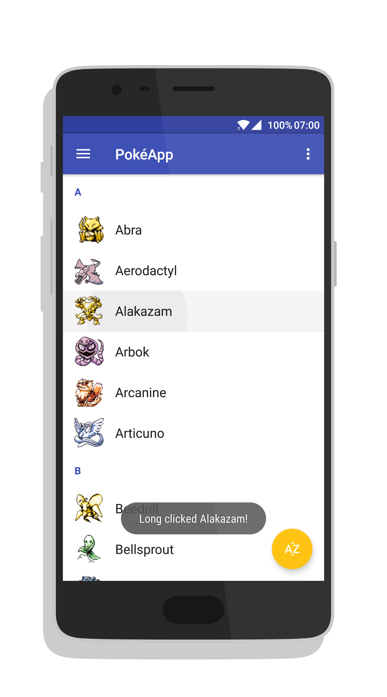

# Introduction

Some months ago, I pushed my first Android library to Github. *UndoRecycler* was its name, and it added some extra features to the `RecyclerView.Adapter`class. It had a built-in OnItem(Long)ClickListener, headers, swipe to dismiss, and undo functionality. Sounds pretty convenient, right?

However, there were two major problems with *UndoRecycler*:  
1) Although it did support both *item* and *header* elements, it didn't really provide a way to use multiple *viewtypes*. It was possible, but the user had to do all the heavy lifting. Furthermore, the *adapter* would become a mess filled with if functions checking for every *viewtype*.  
2) It did provide some useful features, but there was no way for a user to only select the features he wanted. the whole __UndoAdapter__ class had to be extended, with all its mandatory and optional methods for each separate feature. Once again, a mess.

# Architecture

Having accepted the fact that my library wasn't so useful after all in its current state, I decided to try and improve it.

## Level 1

The first problem I tackled, was the limited management of multiple *viewtypes*. The solution? Modular design! Instead of handling every *viewtype* inside of the same large *adapter*, each *viewtype* gets its own __AdapterModule__. When the *adapter* needs some work done for a certain *viewtype*, it just asks the corresponding *module* to do the work for him. Finding the corresponding *module* for a certain *viewtype* is handled by the library, so the only thing the user needs to do, is implement the *modules* by extending the __AdapterModule__ class.

[](art/solution1.png)  
Figure 1: Side by side comparison of old and new architecture.

## Level 2

Quite an improvement already, but the second problem still remains. Each *module* contains methods for every possible feature, even when they are not necessarily used. The solution? Modular design, again! It would be a lot easier if the *modules* could be composed of building blocks corresponding to the necessary features. And are we in luck, because Java offers these building blocks in the form of __Interfaces__. So let's extract the methods for each feature into a corresponding __interface__ and call it a *plugin*. We can now use the __AdapterModule__ class as the fundament for our *module* and just plug in the desired *plugins*.

[](art/solution2.png)  
Figure 2: Modules are composed of plugins to add corresponding functionalities.

## Modular²Recycler
Our *adapter* is now modular on two levels; it is modular squared! The *UndoRecycler* has turned into the *Modular²Recycler*.

### Used patterns

The first level is not just modular, but the *modules* are also reusable. Level 1 implements the [aggregation pattern](https://en.wikipedia.org/wiki/Object_composition#Aggregation). On the second level, the *plugins* can only be used in the *module* in which they were implemented. Level 2 implements the [composition pattern](https://en.wikipedia.org/wiki/Object_composition).

# Code

Now that we understand the architecture of the library, let's take a look at what our code looks like when using it. If the architecture isn't perfectly clear to you yet, don't worry. The following examples will (hopefully) make everything clear. The code used in this section is based on the example app *PokéApp*, which is available both on [Github](https://github.com/RobbeSneyders/Modular2Recycler/tree/master/app) and the [Play Store](https://play.google.com/store/apps/details?id=com.cuttingedge.pokeapp).

## Level 1

Let's say we want to show the images and names of some pokemon in our `RecyclerView`. The only things we need, are a *Pokemon* class implementing __ModularItem__ and a *PokemonModule* extending __AdapterModule__.

```
public class Pokemon implements ModularItem {
    public String name;
    public Drawable icon;

    public boolean isHeader() {
        return false;
    }
}

public class PokemonModule extends AdapterModule<PokemonViewHolder, Pokemon> {

    public PokemonModule(ModularAdapter adapter) {
        super(adapter);
    }

    @Override
    public PokemonViewHolder onCreateViewHolder(ViewGroup parent) {
        View itemView = LayoutInflater.from(parent.getContext()).inflate(R.layout.recycler_row, parent, false);
        return new PokemonViewHolder(itemView);
    }

    @Override
    public void onBindViewHolder(PokemonViewHolder viewHolder, Pokemon pokemon) {
        viewHolder.vText.setText(pokemon.name);
        viewHolder.vIcon.setImageDrawable(pokemon.icon);
    }

    public static class PokemonViewHolder extends RecyclerView.ViewHolder {
        public ImageView vIcon;
        public TextView vText;

        public PokemonViewHolder(View view) {
            super(view);
            vText = (TextView) view.findViewById(R.id.textView);
            vIcon = (ImageView) view.findViewById(R.id.imageView);
        }
    }
}
```

Now we just need to instantiate our __ModularAdapter__ and *PokemonModule*. This can be done from your `Activity`.

```
List<Pokemon> pokemonList = Pokedex.getAllPokemonAlphabetic();

// The adapter is built with a builder class (Not explained in this blog post).
adapter = new ModularAdapterBuilder(recyclerView, pokemonList)
        .build();

new PokemonModule(adapter);
```

And voila, your `RecyclerView` is showing the names and images of your pokemon. 

  

But now it's just a long list of pokemon. A clear overview is missing. So lets fix that by adding in some headers. Again, let's create a *Header* class implementing __ModularItem__ and a *HeaderModule* extending __AdapterModule__. Now just return true in the *isHeader()* method of __ModularItem__ in the *Header* class to make the *adapter* recognize it as a header.

```
public class Header implements ModularItem {
    String name;

    public Header(String name) {
        this.name = name;
    }
    
    public boolean isHeader() {
        // return true to make ModularAdapter recognize this as a header class.
        return true;
    }
}

class HeaderModule extends AdapterModule<HeaderModule.HeaderViewHolder, Header> {

    HeaderModule(ModularAdapter adapter) {
        super(adapter);
    }

    @Override
    public HeaderViewHolder onCreateViewHolder(ViewGroup parent) {
        View headerView = LayoutInflater.from(parent.getContext()).inflate(R.layout.recycler_header, parent, false);
        return new HeaderViewHolder(headerView);
    }

    @Override
    public void onBindViewHolder(HeaderViewHolder viewHolder, Header header) {
        viewHolder.vText.setText(header.name);
    }

    static class HeaderViewHolder extends ViewHolder {
        TextView vText;

        HeaderViewHolder(View view) {
            super(view);
            vText = (TextView) view.findViewById(R.id.textView);
        }
    }
}
```

Add in some headers in the list you provide to the __ModularAdapter__ (you could also insert them directly into the adapter) and instantiate your *HeaderModule*.

```
List<Pokemon> pokemonList = Pokedex.getAllPokemonAlphabetic();
List<ModularItem> list = addHeaders(pokemonList);

// The adapter is built with a builder class (Not explained in this blog post).
adapter = new ModularAdapterBuilder<>(recyclerView, pokemonList)
        .build();

new PokemonModule(adapter);
new HeaderModule(adapter);
```

We now have a list of pokemon, divided by headers.

  

If you want to add some more *viewtypes*, just do the same again over and over. Want to add some digimon to spice it up? Create a *Digimon* class implementing __ModularItem__ and a *DigimonModule* extending __AdapterModule__ and add it to the adapter.

This code clearly shows that the modularity introduced at the first level makes for easy adding of new *viewtypes* and clean code.

## Level 2

However, functionalities ar still lacking. So lets take our *PokemonModule* and expand its functionality by plugging in some *plugins*. What if we want to know when a pokemon was clicked? Just plug in an __ItemClickPlugin__!

```
public class PokemonModule extends AdapterModule<PokemonViewHolder, Pokemon> 
        implements ItemClickPlugin<Pokemon> {

    ...
    // module code
    ...

    @Override
    public void onItemClicked(Pokemon pokemon) {
        // pseudoCode
        toast("Clicked " + pokemon.name + "!");
    }
}
```

That's it! Notice the argument of the *onItemClicked* method in the module. There is no need to find out which pokemon was clicked, since the __ModularAdapter__ does this for you and hands in the clicked *Pokemon* instance as an argument.



You want to add even more functionality to your item, like for instance an OnLongclickListener? (I know, adventurous, right! But it's easiest to explain the concepts with the simplest functionalities). Just plug in an __ItemLongClickPlugin__.

```
public class PokemonModule extends AdapterModule<PokemonViewHolder, Pokemon> 
        implements ItemClickPlugin<Pokemon>, ItemLongClickPlugin<Pokemon> {

    ...
    // module code
    ...

    @Override
    public void onItemClicked(Pokemon pokemon) {
        // pseudoCode
        toast("Clicked " + pokemon.name + "!");
    }

    @Override
    public void onItemClicked(Pokemon pokemon) {
        // pseudoCode
        toast("Long clicked " + pokemon.name + "!");
    }
}
```



### Other plugins

The __SwipePlugin__ and __DragAndDropPlugin__ are also available. They are a bit more complex, but are added in exactly the same way.

# Conclusion

This blog post should give you enough information to start using the library. More hands on information is available on the [project page on Github](https://github.com/RobbeSneyders/Modular2Recycler). I might write a blog post delving deeper into how ModularAdapter works under the hood if there is any interest.

### Feedback

Any feedback is greatly appreciated. Just open up an issue, or [send me an email](mailto:robbe.sneyders@gmail.com).

### Contributions

Any contribution is also greatly appreciated. Just open up an issue, [send me an email](mailto:robbe.sneyders@gmail.com), or submit a pull request.

One way to contribute is by implementing extra plugins.

